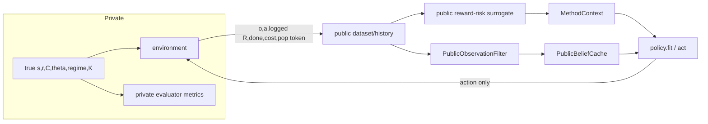

# Beliefs and information regime

Primary implementation:
`src/tracks/general/real_ecology_benchmark/{config,pipeline,beliefs,public_surrogate}.py`
and `src/tracks/general/real_ecology_benchmark/methods/base.py`.

## Hidden versus full

In `src/tracks/general/real_ecology_benchmark/config.py`, `hides_rk()` is true
only for real data with `expose_rk="hidden"`.
Accepted manifests use hidden. In that mode `pipeline._hidden_method_context()`
constructs `MethodContext` with exactly: number of actions, action costs,
qualitative action channels, observation sigma, public horizon, fitted
observation scale, opaque population token, expose/regime labels, reward mode,
and the public surrogate. It withholds species name, true family, N0/K, r caps,
thresholds, process model, and numeric action effects. `BasePolicy.__init__()`
rejects an `EnvironmentConfig` whose `hides_rk()` is true.

## Filter ladder

In `src/tracks/general/real_ecology_benchmark/pipeline.py`,
`make_filter_factory()` implements:

| mode | implementation / assumption | hidden allowed? |
|---|---|---|
| `raw` | `RawObservationFilter` in full; sanitized `PublicObservationFilter` in hidden | yes |
| `learned` | full: fitted linear transition proposal+particle filter; hidden: public observation history only | yes |
| `reference` | `ReferenceProposal` using config | no |
| `ricker` | `MechanisticProposal` assuming Ricker | no |
| `true_family` | mechanistic proposal using actual family | no |
| `native_discrete` | full known-config grid; hidden currently routed to public filter and method-owned fitted solver | yes |
| `oracle` | evaluator true state | no training; full ablation only |
| `faithful_internal` | outer public observation filter; adapted policy owns its candidate beliefs | hidden faithful only |

`ParticleFilter` propagates proposal particles and reweights with the known
lognormal emission, resampling below ESS fraction. `PublicObservationFilter`
creates particles around only the current survey and stores previous/current
survey and timestep as context. `DiscreteGridFilter` performs tabular Bayes
updates. `LearnedLinearProposal`, `MechanisticProposal`, and
`ReferenceProposal` differ in fitted/assumed transition law.
`OracleStateFilter.set_true_state()` is called only from evaluator code;
`pipeline.run_method()` explicitly raises if oracle is requested for a training
cache. `run_oracle_state_ablation()` trains normally and replaces only the
evaluation filter, so it is a ceiling, not an accepted hidden result.

## Belief caches and staleness

In `src/tracks/general/real_ecology_benchmark/beliefs.py`, `BeliefCache` stores
current/next feature vectors, mean states, metadata, and
optional public rho/kappa/K. `PublicBeliefCache` removes control aliases and
stores public feature/mean arrays. Cache filenames are built in
`pipeline.run_method()` from the dataset stem plus
`regime_<expose>.<filter>` (or native grid bins in full mode). Loaded caches are
not checked against `dataset_sha256`, observation scale, filter particle count,
ESS threshold, package hash, or feature code version. Thus a stale same-path
cache can silently be reused.

## Public surrogate and objectives

In `src/tracks/general/real_ecology_benchmark/public_surrogate.py`,
`fit_public_surrogate()` makes an episode-disjoint 80/20 split
with seed `cfg.seed+20_000`, fits feature normalization only on fit rows,
ridge reward regression, and logistic genuine-termination risk (or a constant
fallback). It reports reward RMSE/MAE, risk Brier/log loss/prevalence, and
low-reward-tail error. `evaluator_only_surrogate_diagnostics()` stratifies error
by private safety penalty after evaluation and does not select/refit.

For the six accepted methods, direct code inspection gives:

- RefPlan: `PublicParticlePlanner.plan_marginalized()` calls
  `surrogate.predict()`;
- BA-MCTS: `_simulate_public()` calls the surrogate;
- OGSRL: `_public_rollouts()` calls the surrogate for reward and separately
  uses a low-abundance cost;
- MOOR/PLUS faithful: `CandidatePOMDP.expected_public_reward()` uses the
  `MethodContext` surrogate;
- EVD: `_fit_member()` bootstraps `dataset.rewards` directly.

Therefore five methods plan against an approximation to logged reward, while
EVD fits logged rewards. All six are scored against the environment’s exact
true-next-state reward in `evaluator.py`.

Unclear: representative surrogate error for all accepted cells is not present
in the 144-row accepted CSV. Inspect each external accepted `summary.json` field
`public_surrogate_diagnostics`, or reconstruct from the pinned public `.npz`.
